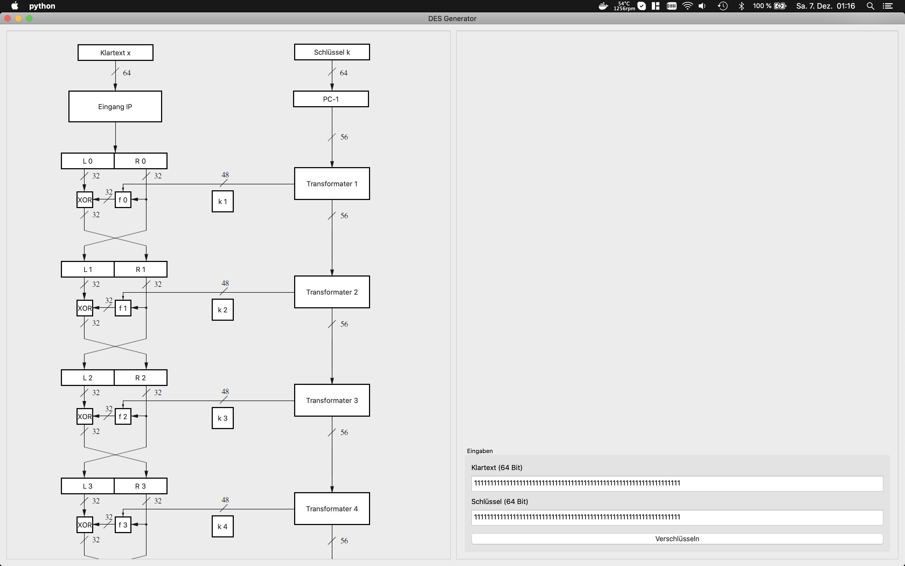

# DES implementation on PyQt5

it shows the [DES](https://en.wikipedia.org/wiki/Data_Encryption_Standard) pipeline graphicaly. You're able to click on processing segments to view the byte manipulation for better understanding the [feistel](https://en.wikipedia.org/wiki/Feistel_cipher) networks working progress.
images used in the gui extracted from: http://www.crypto-textbook.com.
# some nice screenshots

